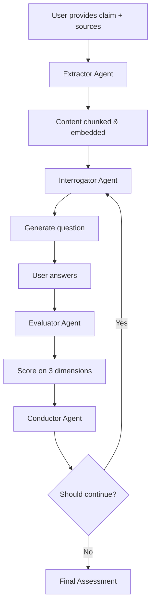

# SONA AI Agent Architecture

## Overview

SONA AI uses a multi-agent architecture powered by CrewAI to orchestrate the learning evaluation process. Each agent has a specific responsibility and works together to provide comprehensive understanding assessment.

## Agent Roles

### 1. **Extractor Agent** 📥
**Role**: Content Extraction Specialist

**Responsibilities**:
- Extract content from multiple source types (PDF, web, YouTube, text)
- Semantic chunking for optimal context windows
- Generate embeddings using OpenAI's embedding models
- Store processed content in Pinecone vector database

**Inputs**:
- Source type and location (URL, file path, raw text)

**Outputs**:
- Processed content chunks
- Embeddings stored in vector DB
- Metadata (title, source type, extraction timestamp)

**Key Methods (via Tools)**:
- `text_extractor` - Raw text processing
- `youtube_extractor` - Transcript API (`youtube_transcript_api`)
- `pdf_extractor` - PDF parsing (`pypdf`)
- `web_scraper` - Website content extraction (`beautifulsoup4`)
- `chunker` - Semantic text splitting (`RecursiveCharacterTextSplitter`)
- `embedding_tool` - Vector generation (`sentence-transformers`)

---

### 2. **Interrogator Agent** 🤔
**Role**: Adaptive Question Generator

**Responsibilities**:
- Generate questions grounded in source material
- Adapt difficulty based on understanding score
- Diversify question types (fact, reasoning, failure, application)
- Maintain tone (friendly, strict, aggressive)
- Avoid repetitive patterns

**Inputs**:
- Session context (claim, understanding score, previous questions)
- Relevant content chunks from vector DB
- Tone and difficulty preferences

**Outputs**:
- Question with metadata (difficulty, type, expected answer type)
- Context chunks used for question generation

**Question Types**:
1. **Fact**: Direct recall ("What is X?")
2. **Reasoning**: Explanation required ("Why does X happen?")
3. **Failure**: Edge cases ("When would X fail?")
4. **Application**: Transfer ("How would you use X for Y?")

**Adaptive Logic**:
```python
if understanding_score > 75:
    difficulty = "hard"
elif understanding_score > 50:
    difficulty = "medium"
else:
    difficulty = "easy"
```

---

### 3. **Evaluator Agent** 📊
**Role**: Understanding Assessment Specialist

**Responsibilities**:
- Evaluate answers on three dimensions:
  - **Correctness** (0-100): Factual accuracy
  - **Depth** (0-100): Contextual understanding
  - **Transfer** (0-100): Application ability
- Detect hallucinations
- Provide detailed reasoning for scores

**Inputs**:
- Question, user answer, reference chunks
- Question metadata (difficulty, type, expected answer type)

**Outputs**:
- Three-dimensional scores
- Detailed explanations for each dimension
- Confidence level (0-1)

**Scoring Formula**:
```
answer_score = 0.5 × correctness + 0.3 × depth + 0.2 × transfer
```

**Depth Evaluation** (Contextual):
- Easy question + short answer = High depth possible
- Hard question + short answer = Low depth likely
- Expects explanation quality relative to difficulty

---

### 4. **Conductor Agent** 🎯
**Role**: Session Orchestrator & Flow Controller

**Responsibilities**:
- Orchestrate question-answer-evaluation flow
- Update understanding score using weighted formula
- Determine when to stop questioning
- Provide final assessment

**Inputs**:
- Session state (understanding score, questions asked)
- Recent answer scores and variance
- Min/max question constraints

**Outputs**:
- Continue/stop decision
- Next difficulty recommendation
- Final assessment (when stopping)

**Understanding Score Update**:
```python
understanding_score = 0.6 × previous_score + 0.4 × answer_score
```

**Stopping Conditions**:
1. Minimum questions reached (e.g., 3)
2. Confidence threshold met (e.g., score stable, low variance)
3. Maximum questions limit (e.g., 15)

**Stopping Logic**:
```python
if questions_asked >= min_questions:
    if score_variance < 10 and questions_asked >= min_questions + 2:
        STOP: "Sufficient confidence in understanding"
    elif questions_asked >= max_questions:
        STOP: "Maximum questions reached"
    else:
        CONTINUE
```

---

---

### 5. **Tutor Agent** 👨‍🏫
**Role**: Personal Learning Assistant

**Responsibilities**:
- Answer student-initiated questions using RAG
- Provide clear, pedagogical explanations citing sources
- Admit when information is missing (honest hallucination prevention)
- Suggest follow-up questions to deepen inquiry

**Inputs**:
- Student question
- Session ID (for isolated retrieval)
- Chat history (optional)

**Outputs**:
- Answer text with citations
- List of source chunks used
- Confidence level
- Follow-up suggestion

**System Prompt Strategy**:
- "You are a helpful, patient AI Tutor..."
- "Answer ONLY using the provided context."
- "If answer is missing, admit it."

---

## Agent Interaction Flow



## Opik Integration

All agents are instrumented with Opik tracing:

```python
@opik_integration.track_agent(
    name="AgentName",
    metadata={"agent_type": "..."}
)
def execute(self, input_data):
    # Agent logic
    pass
```

**Tracked Metrics**:
- LLM calls and tokens
- Agent execution time
- Input/output data
- Scores and evaluations
- Decision reasoning

## Guardrails Integration

Guardrails are applied as a **cross-cutting service**, not a separate agent:

- **Toxicity detection** on user answers
- **Jailbreak prevention** on prompts
- **Content moderation** on generated questions
- **PII detection** on uploaded content

Applied via Opik's guardrails features at multiple checkpoints:
1. Before content extraction
2. After question generation
3. Before answer evaluation

---

## Future Enhancements

1. **Meta-Learning Agent**: Learns from evaluation patterns
2. **Personalization Agent**: Adapts to learning style
3. **Feedback Agent**: Provides constructive explanation
4. **Multi-Modal Agent**: Handles images, diagrams, code
